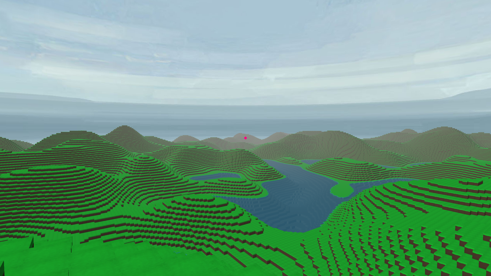

# CubePixel



## Requirements

- Python 3.12+  
- A C compiler like gcc or msvc
- Using a venv is recommended

## Running the game

1. Install dependencies using pip:
```
python -m pip install -r requirements.txt
```
2. Build the cython extension:
```
python setup.py build_ext -i
```
3. Run the game:
```
python main.py
```

## Implemented features

- Procedural world generation
- Saving and loading worlds
- First person player controller with collisions
- Breaking and placing voxels
- Basic inventory
- Static diffuse lighting and fog

## Planed features

- Input binding
- Level of detail
- Multithreaded chunk meshing
- First person viewmodel
- Structure generation
- Dynamic lighting and shadows
- Water surface and underwater shader
- Multiplayer (maybe)
- Physics (maybe)

## Known Bugs

- loading save files is slow on windows

## Credits

- [ursina engine](https://www.ursinaengine.org/) (MIT License)
- [FastNoiseLite](https://github.com/Auburn/FastNoiseLite) (MIT License)
- [phosphor-icons](https://phosphoricons.com/) (MIT License)